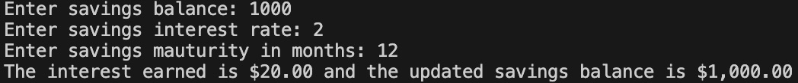
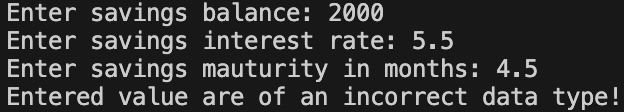
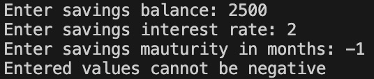

# Customer Banking

## Code Source
The code location is: [Click Here](https://github.com/jaidevkler/customer_banking)
## How to run the program
Enter the following command to run the program:
```bash
python customer_banking.py
```
## Files
### Account.py
* Class - a class of type Account with balance and interest as its attributes. 
* Functions - two setter functions set_balance and set_interest to set the balance and interest respectively.
### cd_account.py
* Imports - the Account class is imported:
    ```bash
    from Account import Account
    ```
* Functions - create_cd_account function:
    * Arguments - balance, interest rate and months
    * Creates a CD Account of type Account, calculates the interest earned, and updates the account balance and interest in the Account class.
    * Returns - updated balance and interest earned
### savings_account.py
* Imports - the Account class is imported:
    ```bash
    from Account import Account
    ```
* Functions - create_savings_account function:
    * Arguments - balance, interest rate and months
    * Creates a Savings Account of type Account, calculates the interest earned, and updates the account balance and interest in the Account class.
    * Returns - updated balance and interest earned
### customer_banking.py
* Imports
    * The sys library is imported to raise a SystemExit exemption, in case if an invalid input is entered by the user, using the following code:
        ```bash
        import sys
        ```
    * The create_cd_account and create_savings_account functions are imported from create_cd_account.py and create_savings_account.py respectively using the following code:
        ```bash
        from cd_account import create_cd_account
        from savings_account import create_savings_account
        ```
* Functions - The main function: <br />
    * The user is prompted to enter the savings balance (type float), interest rate (type float), and months (type int) for the savings account. Depending on the input the following outputs are possible:
        * The create_savings_account function is called to create a savings calculate the new balance and interest earned, in case if valid and positive values are entered by the user. A screen shot of an example output:
            <div style="text-align:left">
                
            </div>
        * An error message stating 'Entered value are of an incorrect data type!' is displayed in case if the user enters an input of the wrong type. This is achieved by using try-except to handle a ValueError and then using sys library to exit the program. A screen shot of an example output:
            <div style="text-align:left">
                
            </div>
        * An error message stating 'Entered values cannot be negative' is displayed in case if the user enters an input that is negative. The program exits using the sys library. A screen shot of an example:
            <div style="text-align:left">
                
            </div>
    * The user is prompted to enter the CD balance (type float), interest rate (type float), and months (type int) for the CD account. Depending on the input the following outputs are possible:
        * The create_cd_account function is called to create a CD account, calculate the new balance and interest earned, in case if valid and positive values are entered by the user. A screen shot of an example output:
            <div style="text-align:left">
                
            </div>
        * An error message stating 'Entered value are of an incorrect data type!' is displayed in case if the user enters an input of the wrong type. This is achieved by using try-except to handle a ValueError and then using sys library to exit the program. A screen shot of an example output:
            <div style="text-align:left">
                
            </div>
        * An error message stating 'Entered values cannot be negative' is displayed in case if the user enters an input that is negative. The program exits using the sys library. A screen shot of an example:
            <div style="text-align:left">
                
            </div>

## Recommendations
The project was done based on the requirements and step-wise approach. I would refactor the code with the following modifications:

* Account.py - add a function to calculate the interest
    ```bash
    def calculate_interest(self, interest_rate, months):
            self.set_interest(self.balance * (interest_rate/100 * months/12))
            self.set_balance(self.balance + self.interest)
    ```
* cd_account.py - reducing the code, by calling the function in the Account class:
    ```bash
    from Account import Account

    def create_cd_account(balance, interest_rate, months):
        new_cd_account = Account(balance, 0)
        new_cd_account.calculate_interest(interest_rate, months)
        
        return  new_cd_account.balance, new_cd_account.interest
    ```

* savings_account.py - reducing the code:
    ```bash
    from Account import Account

    def create_savings_account(balance, interest_rate, months):
        new_savings_account = Account(balance, 0)
        new_savings_account.calculate_interest(interest_rate, months)

        return  new_savings_account.balance, new_savings_account.interest
    ```


    


